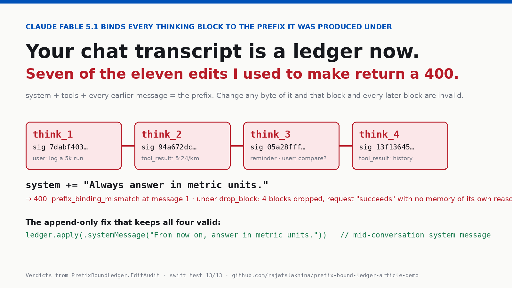

# PrefixBoundLedger

An append-only conversation ledger for a Swift Claude client, built around the rule Claude Fable 5.1
enforces on 1 September 2026: a replayed thinking block is only valid while the `system` prompt, the
`tools`, and every earlier message are byte-for-byte what they were when the block was produced.
Change any of them and the API returns a 400 (or drops the block, if you ask it to).

This repo treats that rule as a *design constraint* instead of an error to catch:

- `ConversationLedger` — an append-only store. There is no API for editing `system`, `tools`, or a
  committed message. Every change is a `Mutation` and every mutation is an append.
- `PrefixFingerprint` — SHA-256 of the canonical prefix a thinking block was produced under, plus a
  chain link to the previous thinking block. That pair is the block's `signature`.
- `PrefixValidator` — a stateless re-implementation of the server-side check, with the two
  documented `prefix_mismatch_behavior` policies (`error` → 400, `drop_block` → `input_transformations`)
  and the silent model-version drop.
- `EditAudit` — eleven naive transcript edits, each applied to a copy of the fixture and run through
  the validator. The verdicts match Anthropic's documented valid/invalid table row for row, and the
  test suite asserts that they do.
- `LedgerDemoView` — a SwiftUI screen that lets you pick a naive edit, watch it fail, and apply the
  append-only mutation that replaces it.

Article: [Your Chat Transcript Is a Ledger Now. Seven of the Eleven Edits I Used to Make Return a 400.](https://medium.com/@er.rajatlakhina/your-chat-transcript-is-a-ledger-now-seven-of-the-eleven-edits-i-used-to-make-return-a-400-5adf4c7574bf) (Medium)



## The idea in code

```swift
var ledger = ConversationLedger(system: Fixture.system, tools: Fixture.tools)
try ledger.apply(.userMessage("Log a 5k run, 27 minutes."))
ledger.recordAssistantTurn(
    thinking: "Distance and time given; call log_workout.",
    blocks: [.toolUse(id: "toolu_1", name: "log_workout", input: "{distance_km:5,minutes:27}")]
)

// The habit that used to be harmless: "just fix" the system prompt.
var edited = ledger.request
edited.system += "\nAlways answer in metric units."

PrefixValidator(policy: .error).validate(edited)
// → .rejected(status: 400, "...prefix_binding_mismatch", firstInvalid: message 1)

// The append-only path that says the same thing and keeps every block valid.
try ledger.apply(.systemMessage("From now on, answer in metric units."))
PrefixValidator(policy: .error).validate(ledger.request)
// → .accepted(request, transformations: [])
```

Deferred tools are the one change to `tools` that is safe, and the ledger models why:

```swift
ledger.declareDeferredTool(ToolDefinition(name: "share", description: "Share a summary"))
// invisible to every existing signature until…
try ledger.apply(.toolAddition("share"))
// …which appends a block; blocks signed *after* it bind to the now-visible tool.
```

## Verification status

- `swift build`: clean, 0 warnings (Swift 6.0.3, Linux aarch64).
- `swift test`: 13/13 passing, including `testAuditAgreesWithDocumentedTableOnEveryRow`.
- **Simulator run: not performed.** This repo was produced by an unattended scheduled session and
  the computer-use grant for Xcode/Simulator cannot be approved in that mode. `LedgerDemoView` was
  reviewed by hand but not compiled. See `Demo/Screenshots/README.md`.

## Run it

```bash
git clone https://github.com/rajatslakhina/prefix-bound-ledger-article-demo.git
cd prefix-bound-ledger-article-demo
swift test                 # library + 13 tests
open Demo.xcodeproj        # pick the Demo scheme, any iOS 17+ Simulator, ⌘R
```

No other setup: `Demo.xcodeproj` consumes the package through a local package reference (`.`).

## Source

Anthropic, *Preserved thinking* — https://platform.claude.com/docs/en/build-with-claude/preserved-thinking
and the Claude Developer Platform release notes for 1 September 2026.

MIT licensed.
